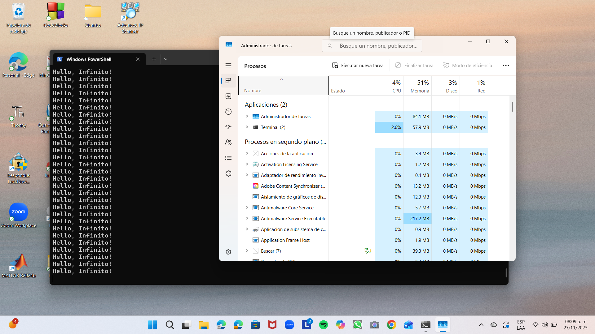

# Bucle Infinito

## Descripción

Este proyecto contiene un **código con un bucle infinito** diseñado para **analizar el consumo de memoria y CPU** mientras se ejecuta. Su propósito es observar cómo se comporta el sistema bajo una carga continua.

---

## Evidencia / Capturas

A continuación se inserta una **captura de pantalla** del consumo de memoria durante la prueba del bucle infinito.

```md

```

---
